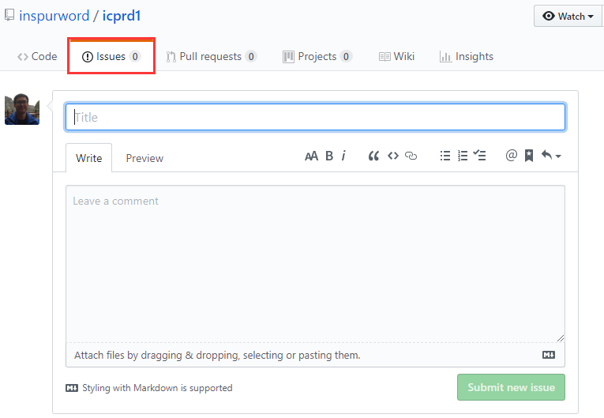

# Inspur Cloud Platform R&D Dep.1

## Welcome
欢迎小伙伴们加入Inspur大家庭

## 使用指南

* 学习总结的提交
  * 以自己的姓名建立目录
  * 学习总结以markdown格式编写，以姓名_日期.md为文件名，如李三_20190522.md
  * 总结需在第二天的8:00之前完成提交
* 问题的提交
  * 在"Issues"页面进行提交，如
  * Title中使用[]区别问题领域，如[Linux]

## Git 简明教程
### clone 项目
1、获取连接

我们的链接为

`git@github.com:inspurcloudgroup/icprd1.git`

2、执行clone命令

`git clone git@github.com:inspurcloudgroup/icprd1.git`

### 新建自己的文件夹

1、进入工程目录

`cd icprd1`

2、新建文件夹

`mkdir yourname`

如：

`mkdir 邓博`

3、新建文件

`touch 邓博_20190520.md`

4、在文件中填写自己心得

### 上传

1、添加暂存库

`git add yourfilename`

如：
`git add 邓博_20190520.md`

2、提交

`git commit -m “提交说明”`

3、上传远程库
首次提交：
`git push -u origin master`
非首次：
`git push`

### 注意

因为是协作项目，要求大家上传自己文件的时候先拉取代码

`git pull`
