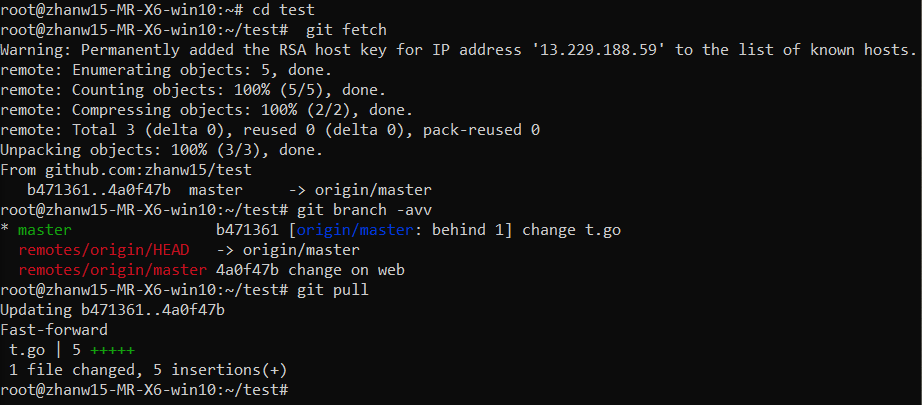
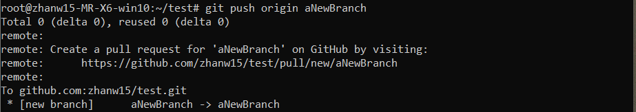

## 学习内容(目录)
```
    │       │
    ├──Git 分支操作
    │       │
    │       ├──添加 SSH 关联授权
    │       │
    │       ├──为 Git 命令设置别名
    │       │
    │       ├──Git 分支管理
    │       │     │
    │       │     ├──git fetch 刷新本地分支信息
    │       │     │
    │       │     ├──创建新的本地分支
    │       │     │
    │       │     ├──将新分支中的提交推送至远程仓库
    │       │     │
    │       │     ├──本地分支跟踪远程分支
    │       │     │
    │       │     ├──删除远程分支
    │       │     │
    │       │     └──本地分支的更名与删除
    │       │
    ├──多人协作 GitHub 部分
    │       │
    │       ├──创建仓库
    │       │
    │       ├──增加合作者
    │       │
    │       ├──添加 issue
    └─      └─
```

## 添加 SSH 关联授权


## Git 分支管理  
### 刷新本地分支信息


### 创建本地分支

### 将新分支中的提交推送至远程仓库


### 删除远程分支



