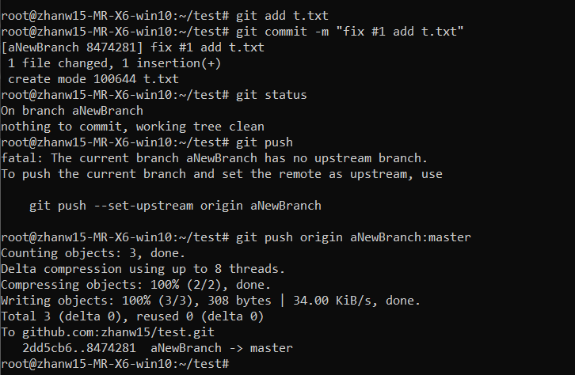
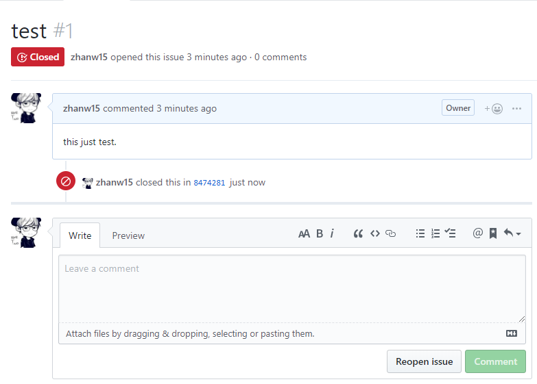
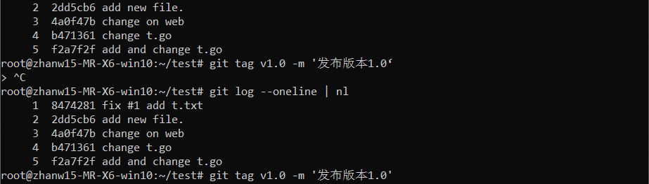
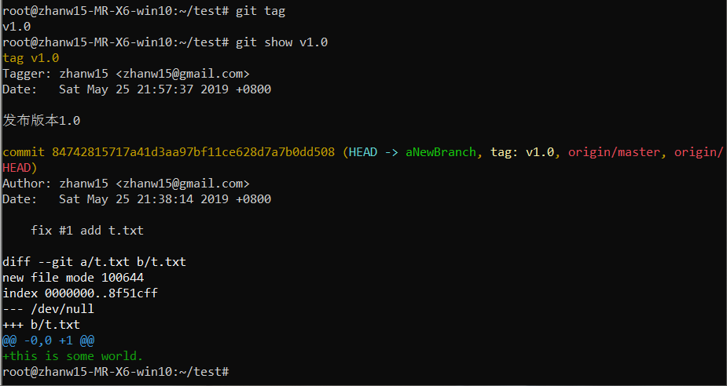
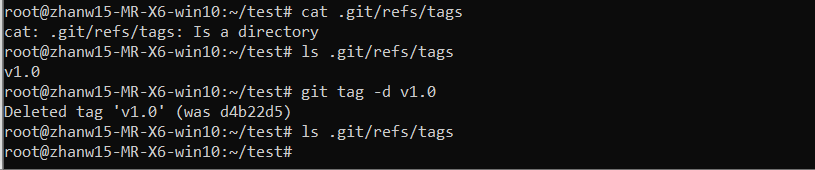
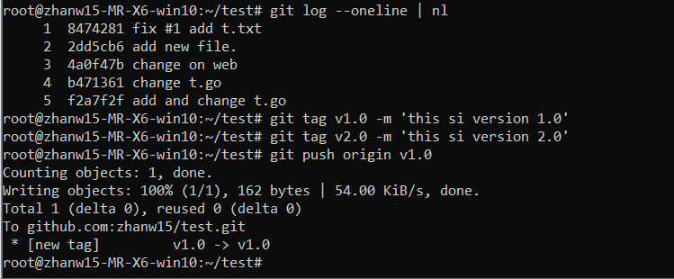
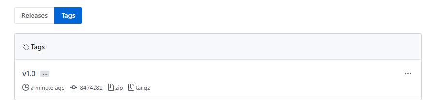
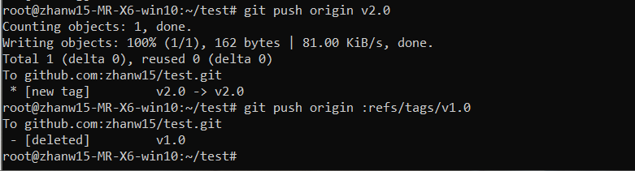
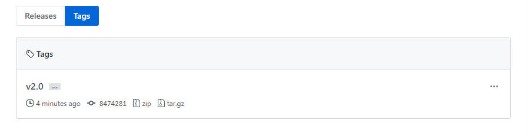
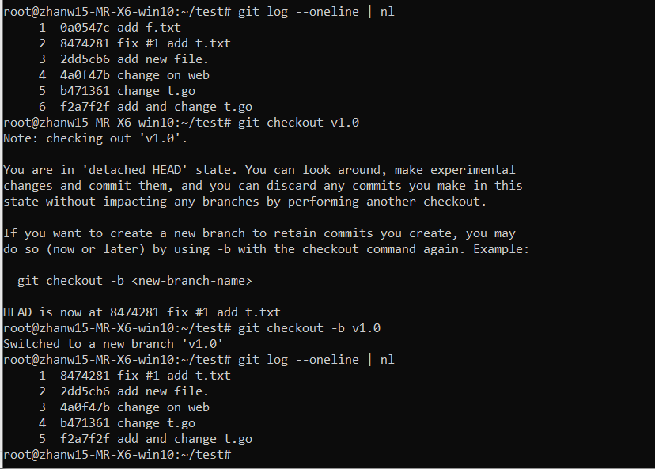

## 学习内容(目录)
```
    │       │
    ├──多人协作Git部分
    │       │
    │       ├──克隆仓库到本地
    │       │
    │       ├──完成任务并推送到自己的仓库
    │       │
    │       ├──提 PR & 检查合并 PR
    │       │
    │       ├──同步主仓库
    │       │
    ├──Git标签tags和GitHub版本releases
    │       │
    │       ├──Git 标签的作用
    │       │     │
    │       │     ├──创建标签
    │       │     │
    │       │     ├──查看标签
    │       │     │
    │       │     ├──删除本地标签
    │       │     │
    │       │     ├──将本地标签推送到远程仓库
    │       │     │
    │       │     ├──删除远程仓库标签
    │       │     │
    │       │     └──签出版本
    │       │
    │       ├──GitHub的releases
    └─      └─
```

## 完成issue并推送
当在执行commit命令时，备注信息中有 "fix #xxx" 字样时，仓库中编号为 #xxx 的 issue 就会自动关闭。



## Git标签
### Git标签的作用
对代码重要的节点添加标记，可使用Git标签。
### 创建Git标签

### 查看Git标签

### 删除本地标签

### push标签到远程


### 删除远程标签


### 迁出版本

