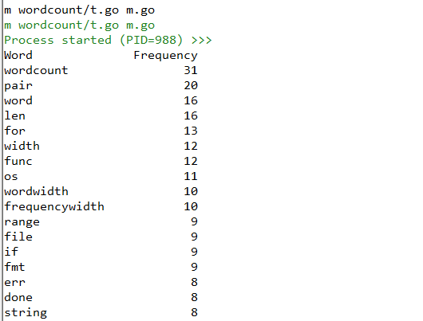

## 学习内容(目录)
```
    │ 
    ├──词频统计程序
    │ 
    ├──GO 语言 IDE 及环境配置
    │       │
    │       ├──Go 开发工具
    │       │     │
    │       │     ├──GOROOT 与 GOPATH
    │       │     │
    │       │     └──常用开发工具
    └─      └─
```

## 词频统计程序
主要为两个源程序，wordcount包实现了并发统计文件单词数量。其并发逻辑是：对于每一个文件，创建一个 goroutine，在这个 goroutine 内部调用UpdateFreq()方法统计对应文件的词频，当统计完成以后会将映射中每一对键值转化为Pair结构发送到results通道，并在发送完成时候发送一个空结构体的值到done通道以表示自己的任务已经完成。我们通过result通道来保证每次只有一个 goroutine 能更新映射。
```go
package wordcount

import (
    "bufio"
    "fmt"
    "io"
    "log"
    "os"
    "sort"
    "strings"
    "unicode"
    "unicode/utf8"
)

type Pair struct {
    Key   string
    Value int
}

type PairList []Pair

func (p PairList) Swap(i, j int)      { p[i], p[j] = p[j], p[i] }
func (p PairList) Len() int           { return len(p) }
func (p PairList) Less(i, j int) bool { return p[j].Value < p[i].Value }

func SplitOnNonLetters(s string) []string {
    notALetter := func(char rune) bool { return !unicode.IsLetter(char) }
    return strings.FieldsFunc(s, notALetter)
}

type WordCount map[string]int

func (source WordCount) Merge(wordcount WordCount) WordCount {
    for k, v := range wordcount {
        source[k] += v
    }

    return source
}

func (wordcount WordCount) Report() {
    words := make([]string, 0, len(wordcount))
    wordWidth, frequencyWidth := 0, 0
    for word, frequency := range wordcount {
        words = append(words, word)
        if width := utf8.RuneCountInString(word); width > wordWidth {
            wordWidth = width
        }
        if width := len(fmt.Sprint(frequency)); width > frequencyWidth {
            frequencyWidth = width
        }
    }
    sort.Strings(words)
    gap := wordWidth + frequencyWidth - len("Word") - len("Frequency")
    fmt.Printf("Word %*s%s\n", gap, " ", "Frequency")
    for _, word := range words {
        fmt.Printf("%-*s %*d\n", wordWidth, word, frequencyWidth,
            wordcount[word])
    }
}

func (wordcount WordCount) SortReport() {
    p := make(PairList, len(wordcount))
    i := 0
    for k, v := range wordcount { 
        p[i] = Pair{k, v}
        i++
    }

    sort.Sort(p) 

    wordWidth, frequencyWidth := 0, 0
    for _, pair := range p {
        word, frequency := pair.Key, pair.Value
        if width := utf8.RuneCountInString(word); width > wordWidth {
            wordWidth = width
        }
        if width := len(fmt.Sprint(frequency)); width > frequencyWidth {
            frequencyWidth = width
        }
    }
    gap := wordWidth + frequencyWidth - len("Word") - len("Frequency")
    fmt.Printf("Word %*s%s\n", gap, " ", "Frequency")

    for _, pair := range p {
        fmt.Printf("%-*s %*d\n", wordWidth, pair.Key, frequencyWidth,
            pair.Value)
    }

}

func (wordcount WordCount) UpdateFreq(filename string) {
    var file *os.File
    var err error

    if file, err = os.Open(filename); err != nil {
        log.Println("failed to open the file: ", err)
        return
    }
    defer file.Close() 

    reader := bufio.NewReader(file)
    for {
        line, err := reader.ReadString('\n')
        for _, word := range SplitOnNonLetters(strings.TrimSpace(line)) {
            if len(word) > utf8.UTFMax ||
                utf8.RuneCountInString(word) > 1 {
                wordcount[strings.ToLower(word)] += 1
            }
        }
        if err != nil {
            if err != io.EOF {
                log.Println("failed to finish reading the file: ", err)
            }
            break
        }
    }
}

func (wordcount WordCount) WordFreqCounter(files []string) {

    results := make(chan Pair, len(files)) 
    done := make(chan struct{}, len(files)) 

    for i := 0; i < len(files); { 
        go func(done chan<- struct{}, results chan<- Pair, filename string) {
            wordcount := make(WordCount)
            wordcount.UpdateFreq(filename)
            for k, v := range wordcount {
                pair := Pair{k, v}
                results <- pair
            }
            done <- struct{}{}
        }(done, results, files[i])

        i++
    }

    for working := len(files); working > 0; { 
        select {
        case pair := <-results:
            wordcount[pair.Key] += pair.Value

        case <-done:
            working--

        }
    }

DONE:
    for {
        select {
        case pair := <-results:
            wordcount[pair.Key] += pair.Value
        default:
            break DONE
        }
    }

    close(results)
    close(done)

}
```
```go
package main

import (
    "fmt"
    "os"
    "path/filepath"
    "wordcount"
)

func main() {
    if len(os.Args) == 1 || os.Args[1] == "-h" || os.Args[1] == "--help" {
        fmt.Printf("usage: %s <file1> [<file2> [... <fileN>]]\n", filepath.Base(os.Args[0]))
        os.Exit(1)
    }

    wordcounter := make(wordcount.WordCount)

    wordcounter.WordFreqCounter(os.Args[1:])

    wordcounter.SortReport()
}
```

### 环境变量GOROOT
GOROOT为go的安装路径。
### 环境变量GOPATH
GOPATH为import包时的搜索路径。