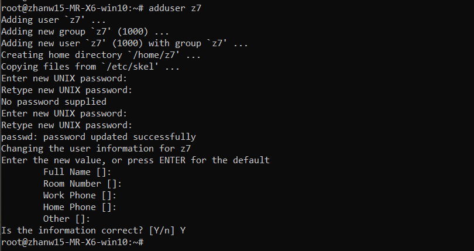

## 学习内容(目录)
```
    │       │
    ├──Linux 系统简介
    │       │
    ├──基本概念及操作
    │       │
    │       ├──桌面环境
    │       │     │
    │       │     ├──Linux 桌面环境介绍
    │       │     │
    │       │     └──Linux 桌面环境的使用
    │       │
    │       ├──linux终端
    │       │     │
    │       │     ├──Shell
    │       │     │
    │       │     └──命令行操作
    │       │           │
    │       │           ├──重要快捷键
    │       │           │
    │       │           ├──学会利用历史输入命令
    │       │           │
    │       │           ├──学会使用通配符
    │       │           │
    │       │           └──学会在命令行中获取帮助
    │       │    
    ├──用户及文件权限管理
    │       │
    │       ├──Linux 用户管理
    │       │     │
    │       │     ├──查看用户
    │       │     │
    │       │     ├──创建用户
    │       │     │
    │       │     ├──用户组
    │       │     │
    │       │     └──删除用户
    │       │
    │       ├──Linux 文件权限
    │       │     │
    │       │     ├──查看文件权限
    │       │     │
    │       │     ├──变更文件所有者
    │       │     │
    │       │     └──修改文件权限
    └─      └─
```

## linux常用快捷键
按键 |作用
   - |- 
Ctrl+d	 |键盘输入结束或退出终端 |
Ctrl+s	 |暂停当前程序，暂停后按下任意键恢复运行 |
Ctrl+z	 |将当前程序放到后台运行，恢复到前台为命令fg |
Ctrl+a	 |将光标移至输入行头，相当于Home键 |
Ctrl+e	 |将光标移至输入行末，相当于End键 |
Ctrl+k	 |删除从光标所在位置到行末 |
Alt+Backspace	 |向前删除一个单词 |
Shift+PgUp	 |将终端显示向上滚动 |
Shift+PgDn	 |将终端显示向下滚动 |

### SHELL通配符
字符 |含义
   - |-
*	 |匹配 0 或多个字符 |
?	 |匹配任意一个字符 |
[list]	 |匹配 list 中的任意单一字符 |
[^list]	 |匹配 除list 中的任意单一字符以外的字符 |
[c1-c2]	 |匹配 c1-c2 中的任意单一字符 如：[0-9] [a-z] |
{string1,string2,...}	 |匹配 string1 或 string2 (或更多)其一字符串 |
{c1..c2}	 |匹配 c1-c2 中全部字符 如{1..10} |

### 在命令行使用帮助
区段 |说明
   - |-
1	|一般命令 |
2	|系统调用 |
3	|库函数，涵盖了C标准函数库 |
4	|特殊文件（通常是/dev中的设备）和驱动程序 |
5	|文件格式和约定 |
6	|游戏和屏保 |
7	|杂项 |
8	|系统管理命令和守护进程 |
在 man 中使用搜索/<你要搜索的关键字>，查找完毕后你可以使用n键切换到下一个关键字所在处，shift+n为上一个关键字所在处。使用Space翻页，Enter向下滚动一行，或者使用k,j进行向前向后滚动一行。按下h键为显示使用帮助，按下q退出。

### who命令
参数 |说明
   - |-
-a	|打印能打印的全部 |
-d	|打印死掉的进程 |
-m	|同am i,mom likes |
-q	|打印当前登录用户数及用户名 |
-u	|打印当前登录用户登录信息 |
-r	|打印运行等级 |

### 添加新用户


### 文件权限
读、写、执行为4，2，1，如拥有该权限则加数字，无该权限则为0。每个文件有三组权限，分别为拥有者，所属用户组，其他用户。

chmod 777 xxx 可为文件xxx更改权限。
