## 学习内容(目录)
```
    │       │
    ├──Linux目录结构及文件基本操作
    │       │
    │       ├──Linux 目录结构
    │       │     │
    │       │     ├──FHS 标准
    │       │     │
    │       │     └──目录路径
    │       │           │
    │       │           ├──绝对路径
    │       │           │
    │       │           └──相对路径
    │       │
    │       ├──Linux 文件的基本操作
    │       │     │
    │       │     ├──新建
    │       │     │
    │       │     ├──复制
    │       │     │
    │       │     ├──删除
    │       │     │
    │       │     ├──移动与重命名
    │       │     │
    │       │     ├──查看文件
    │       │     │
    │       │     ├──查看文件类型
    │       │     │
    │       │     └──编辑文件
    └─      └─
```

## linux目录操作
### FHS标准
FHS标准规定了大部分目录结构与文件夹具体存储的文件，使得文件系统较为有序。
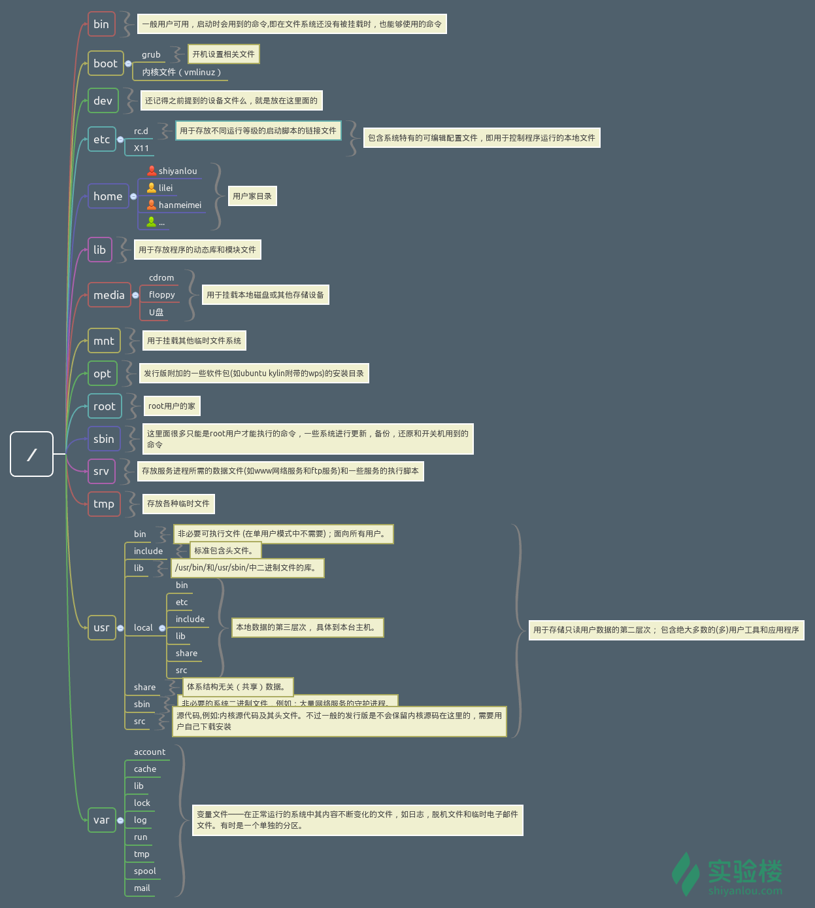
可以使用tree查看linux目录结构。
### 目录路径
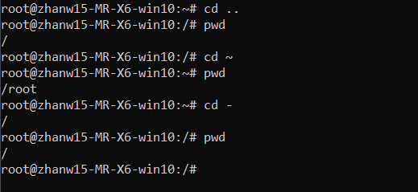
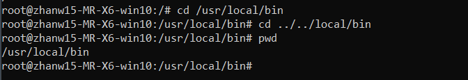
在进行目录切换的过程中请多使用 Tab 键自动补全，可避免输入错误，连续按两次 Tab 可以显示全部候选结果。
## linux文件的基本操作
### 新建
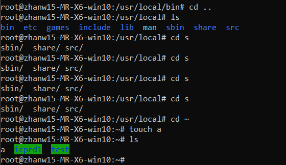
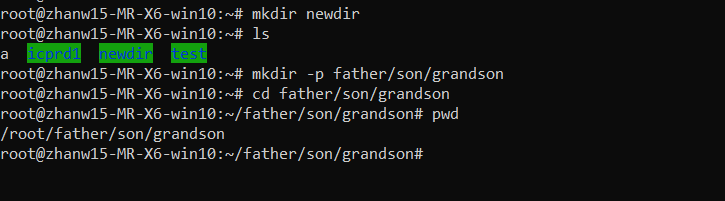
### 复制
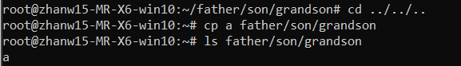
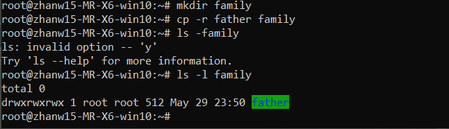
### 删除
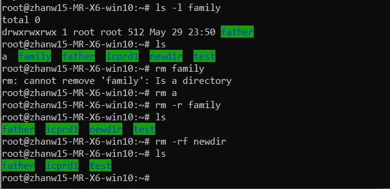
### 移动与重命名
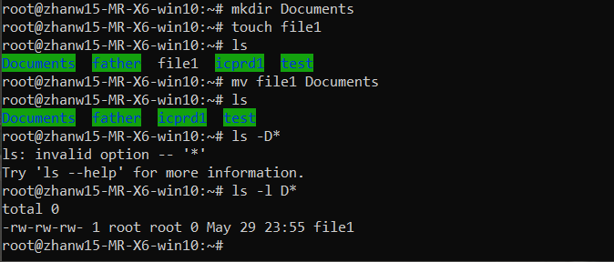
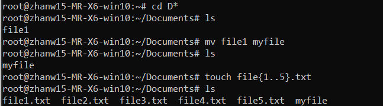
### 查看文件
cat 为正序显示，tac 为倒序显示，打印文件到标准输出。   
nl 命令，添加行号并打印，这是个比 cat -n 更专业的行号打印命令。  
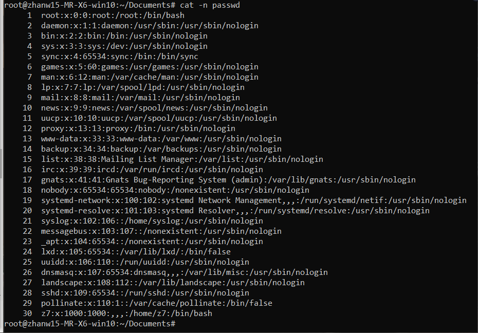
使用 more 和 less 命令可分页查看文件。    
使用 head 和 tail 命令查看文件前几行或后几行。  
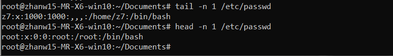
### 查看文件类型
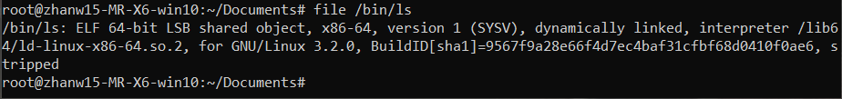
### 编辑文件
使用vim编辑器编辑文件，可使用vimtutor进行学习vim使用方式。
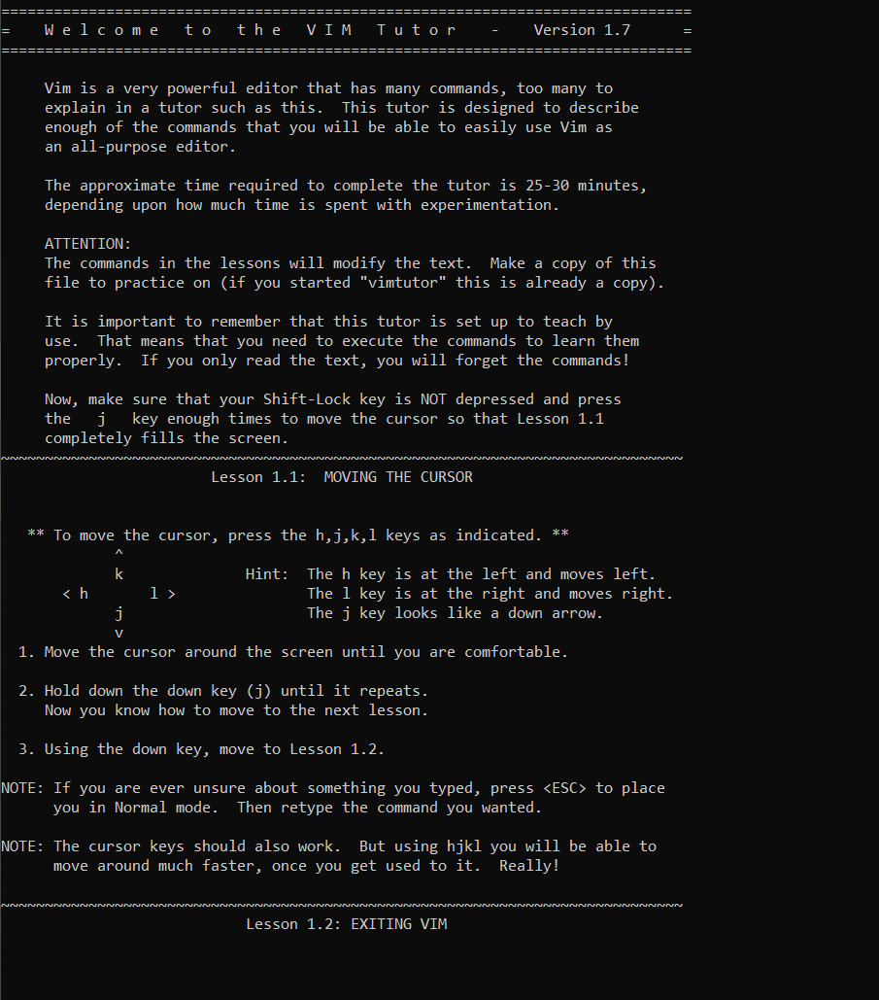
