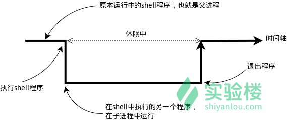

## 学习内容(目录)
```
    │       │
    ├──环境变量与文件查找
    │       │
    │       ├──环境变量
    │       │     │
    │       │     ├──环境变量
    │       │     │
    │       │     ├──命令的查找路径与顺序
    │       │     │
    │       │     ├──添加自定义路径到PATH环境变量
    │       │     │
    │       │     ├──修改和删除已有变量
    │       │     │
    │       │     └──如何让环境变量立即生效
    │       │
    │       ├──搜索文件
    │       │     │
    │       │     ├──whereis
    │       │     │
    │       │     ├──locate
    │       │     │
    │       │     ├──which
    │       │     │
    │       │     └──find
    └─      └─
```

## 环境变量
### 环境变量
。环境变量的作用域比自定义变量的要大，如 Shell 的环境变量作用于自身和它的子进程。在所有的 UNIX 和类 UNIX 系统中，每个进程都有其各自的环境变量设置，且默认情况下，当一个进程被创建时，除了创建过程中明确指定的话，它将继承其父进程的绝大部分环境设置。Shell 程序也作为一个进程运行在操作系统之上，而我们在 Shell 中运行的大部分命令都将以 Shell 的子进程的方式运行。     



```go
$ temp=shiyanlou
$ export temp_env=shiyanlou
$ env|sort>env.txt
$ export|sort>export.txt
$ set|sort>set.txt
```
上述操作将命令输出通过管道 | 使用 sort 命令排序，再重定向到对象文本文件中。
```go
$ vimdiff env.txt export.txt set.txt
```
## 使环境变量永久生效
，Linux 变量可分为两类：   

永久的：需要修改配置文件，变量永久生效；     

临时的：使用 export 命令行声明即可，变量在关闭 shell 时失效。   

这里介绍两个重要文件 /etc/bashrc（有的 Linux 没有这个文件） 和 /etc/profile ，它们分别存放的是 shell 变量和环境变量。还有要注意区别的是每个用户目录下的一个隐藏文件：
```go
.profile 可以用 ls -a 查看
cd /home/shiyanlou
ls -a 
```
这个 .profile 只对当前用户永久生效。而写在 /etc/profile 里面的是对所有用户永久生效，所以如果想要添加一个永久生效的环境变量，只需要打开 /etc/profile，在最后加上你想添加的环境变量。
### 修改和删除已有变量     

### 如何让环境变量立即生效
前面我们在 Shell 中修改了一个配置脚本文件之后（比如 zsh 的配置文件 home 目录下的 .zshrc），每次都要退出终端重新打开甚至重启主机之后其才能生效，很是麻烦，我们可以使用 source 命令来让其立即生效，如：
```go
$ cd /home/shiyanlou
$ source .zshrc
````
source 命令还有一个别名就是 .，上面的命令如果替换成 . 的方式就该是：   
```go
$ . ./.zshrc
```
在使用.的时候，需要注意与表示当前路径的那个点区分开。   
注意第一个点后面有一个空格，而且后面的文件必须指定完整的绝对或相对路径名，source 则不需要。 
### locate 快而全
通过“ /var/lib/mlocate/mlocate.db ”数据库查找，不过这个数据库也不是实时更新的，系统会使用定时任务每天自动执行 updatedb 命令更新一次，所以有时候你刚添加的文件，它可能会找不到，需要手动执行一次 updatedb 命令（在我们的环境中必须先执行一次该命令）。它可以用来查找指定目录下的不同文件类型，如查找 /etc 下所有以 sh 开头的文件：
```go
$ sudo apt-get update
$ sudo apt-get install locate
$ locate /etc/sh
```
> 注意，它不只是在 /bin 目录下查找，还会自动递归子目录进行查找。  

查找 /usr/share/ 下所有 jpg 文件：   
```go
$ locate /usr/share/\*.jpg
```
注意要添加 * 号前面的反斜杠转义，否则会无法找到。  

如果想只统计数目可以加上 -c 参数，-i 参数可以忽略大小写进行查找，whereis 的 -b、-m、-s 同样可以使用。

### which 小而精
which 本身是 Shell 内建的一个命令，我们通常使用 which 来确定是否安装了某个指定的软件，因为它只从 PATH 环境变量指定的路径中去搜索命令：
```go
$ which man
```
### find 精而细
find 应该是这几个命令中最强大的，它不但可以通过文件类型、文件名进行查找而且可以根据文件的属性（如文件的时间戳，文件的权限等）进行搜索。这条命令表示去 /etc/ 目录下面 ，搜索名字叫做 interfaces 的文件或者目录。这是 find 命令最常见的格式，千万记住 find 的第一个参数是要搜索的地方：
```go
$ sudo find /etc/ -name interfaces
```
注意 find 命令的路径是作为第一个参数的， 基本命令格式为 find [path] [option] [action] 。  

与时间相关的命令参数：      

