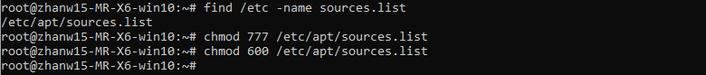
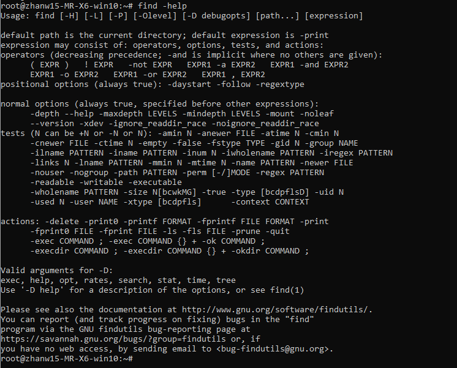

## 学习内容(目录)
```
    │       │
    ├──挑战：寻找文件
    │       │
    ├──文件打包与压缩
    │       │
    │       ├──压缩包格式
    │       │
    │       ├──压缩实战
    │       │     │
    │       │     ├──zip命令
    │       │     │
    │       │     ├──unzip命令
    │       │     │
    │       │     └──tar打包工具
    │       │
    └─      └─
```

## 挑战：寻找文件
### 目标
- 找到 sources.list 文件   
- 把文件所有者改为自己    
- 把权限修改为仅仅只有自己可读可写   



## 压缩与解压
### zip命令
```go
$ cd /home/shiyanlou
$ zip -r -q -o shiyanlou.zip /home/shiyanlou/Desktop
$ du -h shiyanlou.zip
$ file shiyanlou.zip
```
设置压缩级别为 9 和 1（9 最大，1 最小），重新打包：
```go
$ zip -r -9 -q -o shiyanlou_9.zip /home/shiyanlou/Desktop -x ~/*.zip
$ zip -r -1 -q -o shiyanlou_1.zip /home/shiyanlou/Desktop -x ~/*.zip
```
用 du 命令分别查看默认压缩级别、最低、最高压缩级别及未压缩的文件的大小：
```go
$ du -h -d 0 *.zip ~ | sort
```
使用 -e 参数可以创建加密压缩包：
```go
$ zip -r -e -o shiyanlou_encryption.zip /home/shiyanlou/Desktop
```

### unzip命令
将 shiyanlou.zip 解压到当前目录：
```go
$ unzip shiyanlou.zip
```

使用安静模式，将文件解压到指定目录：
```go
$ unzip -q shiyanlou.zip -d ziptest
```

上述指定目录不存在，将会自动创建。如果你不想解压只想查看压缩包的内容你可以使用 -l 参数：
```go
$ unzip -l shiyanlou.zip
```

<strong>注意：</strong> 使用 unzip 解压文件时我们同样应该注意兼容问题，不过这里我们关心的不再是上面的问题，而是中文编码的问题，通常 Windows 系统上面创建的压缩文件，如果有有包含中文的文档或以中文作为文件名的文件时默认会采用 GBK 或其它编码，而 Linux 上面默认使用的是 UTF-8 编码，如果不加任何处理，直接解压的话可能会出现中文乱码的问题（有时候它会自动帮你处理），为了解决这个问题，我们可以在解压时指定编码类型。

使用 -O（英文字母，大写 o）参数指定编码类型：
```go
unzip -O GBK 中文压缩文件.zip
```

### tar命令
在 Linux 上面更常用的是 tar 工具，tar 原本只是一个打包工具，只是同时还是实现了对 7z、gzip、xz、bzip2 等工具的支持，这些压缩工具本身只能实现对文件或目录（单独压缩目录中的文件）的压缩，没有实现对文件的打包压缩，所以我们也无需再单独去学习其他几个工具，tar 的解压和压缩都是同一个命令，只需参数不同，使用比较方便。   

下面先掌握 tar 命令一些基本的使用方式，即不进行压缩只是进行打包（创建归档文件）和解包的操作。   

创建一个 tar 包：
```go
$ cd /home/shiyanlou
$ tar -cf shiyanlou.tar /home/shiyanlou/Desktop
```go
上面命令中，-c 表示创建一个 tar 包文件，-f 用于指定创建的文件名，注意文件名必须紧跟在 -f 参数之后，比如不能写成 tar -fc shiyanlou.tar，可以写成 tar -f shiyanlou.tar -c ~。你还可以加上 -v 参数以可视的的方式输出打包的文件。上面会自动去掉表示绝对路径的 /，你也可以使用 -P 保留绝对路径符。

- 解包一个文件（-x 参数）到指定路径的已存在目录（-C 参数）：
```go
$ mkdir tardir
$ tar -xf shiyanlou.tar -C tardir
```
- 只查看不解包文件 -t 参数：
```go
$ tar -tf shiyanlou.tar
```
- 保留文件属性和跟随链接：
```go
$ tar -cphf etc.tar /etc
```

- 在创建 tar 文件的基础上添加 -z 参数，使用 gzip 来压缩文件：
```go
$ tar -czf shiyanlou.tar.gz /home/shiyanlou/Desktop
```
- 解压 *.tar.gz 文件：
```go
$ tar -xzf shiyanlou.tar.gz
```
