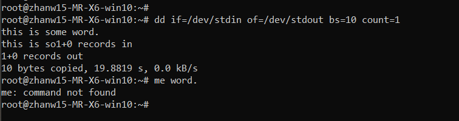

## 学习内容(目录)
```
    │       │
    ├──文件系统操作与磁盘管理
    │       │
    │       ├──基本操作
    │       │     │
    │       │     ├──df命令
    │       │     │
    │       │     └──du命令
    │       │
    │       ├──简单的磁盘管理
    │       │     │
    │       │     └──创建虚拟磁盘
    │       │           │
    │       │           ├──dd命令
    │       │           │
    │       │           ├──创建虚拟镜像文件
    │       │           │
    │       │           ├──mkfs命令
    │       │           │
    │       │           ├──mount命令
    │       │           │
    │       │           ├──umount命令
    │       │           │
    │       │           └──fdisk命令
    │       │    
    ├──Linux下的帮助命令
    │       │
    │       ├──内建命令与外部命令
    │       │
    │       ├──帮助命令的使用
    │       │     │
    │       │     ├──help命令
    │       │     │
    │       │     ├──man命令
    │       │     │
    │       │     └──info命令
    └─      └─
```

## 磁盘管理命令
### 使用df命令查看磁盘的容量


### 使用 du 命令查看目录的容量


```linux
du -h #同--human-readable 以K，M，G为单位，提高信息的可读性。
du -a #同--all 显示目录中所有文件的大小。
du -s #同--summarize 仅显示总计，只列出最后加总的值。
```

## 创建虚拟磁盘
### dd命令




### dd 命令创建虚拟镜像文件


### mount命令挂载磁盘到目录树

```linux
$ mount -o loop -t ext4 virtual.img /mnt 
# 也可以省略挂载类型，很多时候 mount 会自动识别

# 以只读方式挂载
$ mount -o loop --ro virtual.img /mnt
# 或者mount -o loop,ro virtual.img /mnt
```

### umount 命令卸载已挂载磁盘
```linux
# 命令格式 sudo umount 已挂载设备名或者挂载点，如：
$ sudo umount /mnt
```

## linux下的帮助命令
### 内建命令与外部命令
> <strong>内建命令</strong>实际上是 shell 程序的一部分，其中包含的是一些比较简单的 Linux 系统命令，这些命令是写在bash源码的builtins里面的，由 shell 程序识别并在 shell 程序内部完成运行，通常在 Linux 系统加载运行时 shell 就被加载并驻留在系统内存中。而且解析内部命令 shell 不需要创建子进程，因此其执行速度比外部命令快。比如：history、cd、exit 等等。   

> <strong>外部命令</strong>是 Linux 系统中的实用程序部分，因为实用程序的功能通常都比较强大，所以其包含的程序量也会很大，在系统加载时并不随系统一起被加载到内存中，而是在需要时才将其调入内存。虽然其不包含在 shell 中，但是其命令执行过程是由 shell 程序控制的。外部命令是在 Bash 之外额外安装的，通常放在/bin，/usr/bin，/sbin，/usr/sbin等等。比如：ls、vi等。   

可以使用　type 命令来区分命令是内建的还是外部的。   


### help命令
> help 命令只能用于显示内建命令的帮助信息。


### man命令
> 得到的内容比用 help 更多更详细，而且　man　没有内建与外部命令的区分，因为 man 工具是显示系统手册页中的内容，也就是一本电子版的字典，这些内容大多数都是对命令的解释信息，还有一些相关的描述。通过查看系统文档中的 man 也可以得到程序的更多相关信息和 Linux 的更多特性。   


### info命令
> info 来自自由软件基金会的 GNU 项目，是 GNU 的超文本帮助系统，能够更完整的显示出 GNU 信息。所以得到的信息当然更多。   
man 和 info 就像两个集合，它们有一个交集部分，但与 man 相比，info 工具可显示更完整的　GNU　工具信息。若 man 页包含的某个工具的概要信息在 info 中也有介绍，那么 man 页中会有“请参考 info 页更详细内容”的字样。
