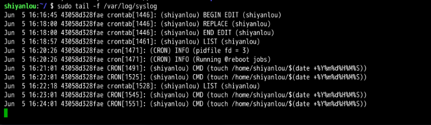
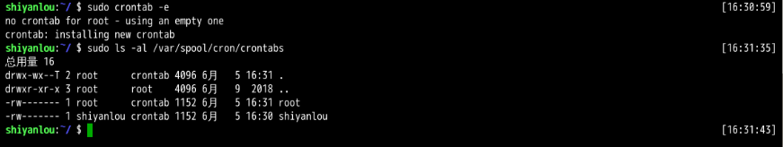

## 学习内容(目录)
```
    │       │
    ├──任务计划crontab
    │       │
    │       ├──crontab 的使用
    │       │     │
    │       │     ├──crontab 简介
    │       │     │
    │       │     ├──crontab 准备
    │       │     │
    │       │     └──crontab 使用
    │       │
    │       ├──crontab 的深入
    │       │  
    ├──挑战：备份日志
    └─      └─
```

## 任务计划crontab
### crontab格式
```linux
# Example of job definition:
# .---------------- minute (0 - 59)
# |  .------------- hour (0 - 23)
# |  |  .---------- day of month (1 - 31)
# |  |  |  .------- month (1 - 12) OR jan,feb,mar,apr ...
# |  |  |  |  .---- day of week (0 - 6) (Sunday=0 or 7) OR sun,mon,tue,wed,thu,fri,sat
# |  |  |  |  |
# *  *  *  *  * user-name command to be executed
隐藏环境
```
### crontab的使用






## 挑战：备份日志
