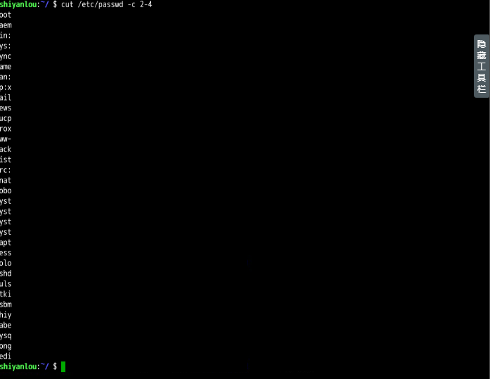
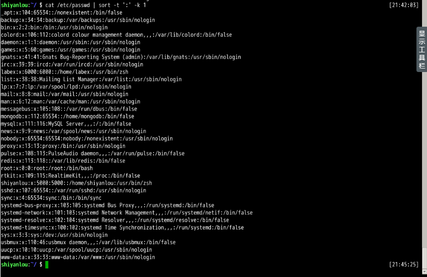

## 学习内容(目录)
```
    │       │
    ├──命令执行顺序控制与管道
    │       │
    │       ├──命令执行顺序控制
    │       │     │
    │       │     ├──顺序执行多条命令
    │       │     │
    │       │     └──有选择的执行命令
    │       │
    │       ├──管道
    │       │     │
    │       │     ├──试用
    │       │     │
    │       │     ├──cut 命令
    │       │     │
    │       │     ├──grep 命令
    │       │     │
    │       │     ├──wc 命令
    │       │     │
    │       │     ├──sort 命令
    │       │     │
    │       │     └──uniq 命令
    └─      └─
```

## 命令执行顺序控制

### 顺序执行多条命令
```linux
$ sudo apt-get update;sudo apt-get install some-tool;some-tool
# 让它自己运行
```


### which 命令
which来查找是否安装某个命令，&&后表示返回值为0时要执行的内容，||表示返回值为非0时执行的内容。$? 为上个命令的返回值。


### 有选择执行多条命令


## 管道
### cut 命令
> 打印每一行的某个字段。   



### grep 命令
> grep 命令用于匹配和查找字符串。   


### wc 命令
> wc 命令用于统计并输出一个文件中行、单词和字节的数目。   


### sort 命令
```linux
# 默认为字典排序：
$ cat /etc/passwd | sort

# 反转排序：
$ cat /etc/passwd | sort -r

# 按特定字段排序：
$ cat /etc/passwd | sort -t':' -k 3

# -k 指定字段； -n 指定数字排序
$ cat /etc/passwd | sort -t':' -k 3 -n
```


### uniq命令
> uniq命令可以用于过滤或者输出重复行。   

