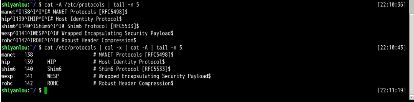
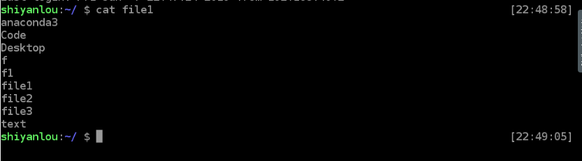
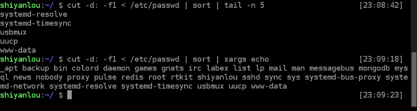

## 学习内容(目录)
```
    │       │
    ├──简单的文本处理
    │       │
    │       ├──文本处理命令
    │       │     │
    │       │     ├──tr 命令
    │       │     │
    │       │     ├──col 命令
    │       │     │
    │       │     ├──join 命令
    │       │     │
    │       │     └──paste命令
    │       │
    ├──数据流重定向
    │       │
    │       ├──数据流重定向
    │       │
    │       ├──标准错误重定向
    │       │
    │       ├──tee 命令
    │       │
    │       ├──永久重定向
    │       │
    │       ├──创建输出文件描述符
    │       │
    │       ├──关闭文件描述符
    │       │
    │       ├──屏蔽命令的输出
    │       │
    ├──挑战：历史命令
    └─ 
```

## 文本处理

### tr 命令


### col 命令
> col 命令可以将Tab换成对等数量的空格键，或反转这个操作。  




### join 命令
> join 命令就是用于将两个文件中包含相同内容的那一行合并在一起。  


### paste 命令
> paste 命令在不对比数据的情况下，简单地将多个文件合并一起，以Tab隔开。  


## 数据流重定向

### 重定向到文件


### 文件描述符与设备文件


### exec 命令
> exec命令的作用是使用指定的命令替换当前的 Shell，即使用一个进程替换当前进程，或者指定新的重定向。   



### xargs 命令
> xargs 命令作用是将参数列表转换成小块分段传递给其他命令，以避免参数列表过长的问题。   



