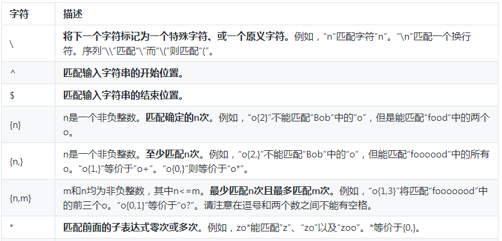
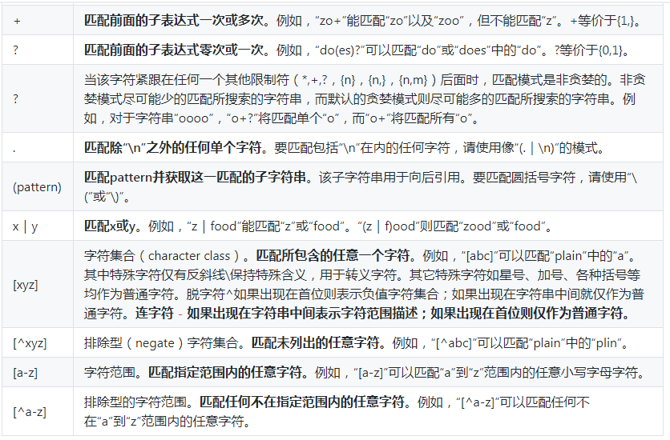
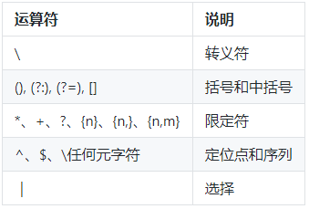
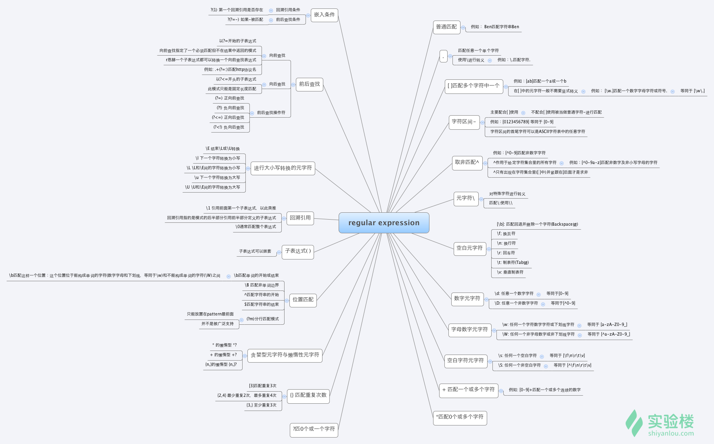
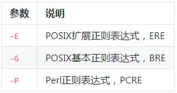
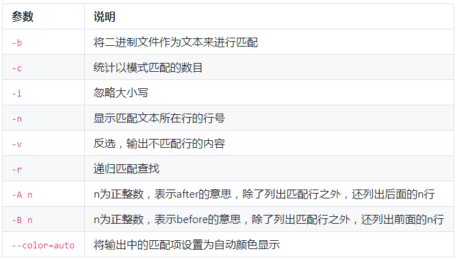
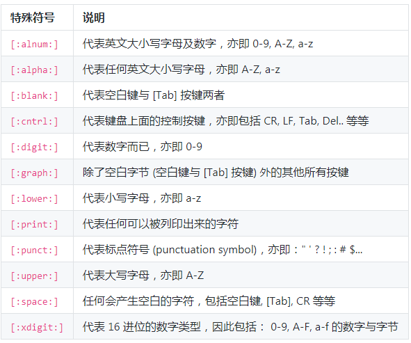
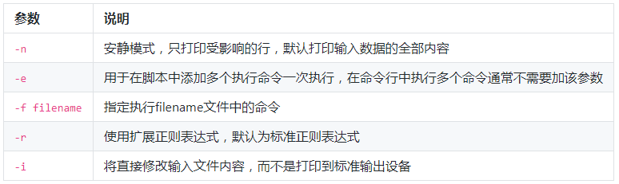
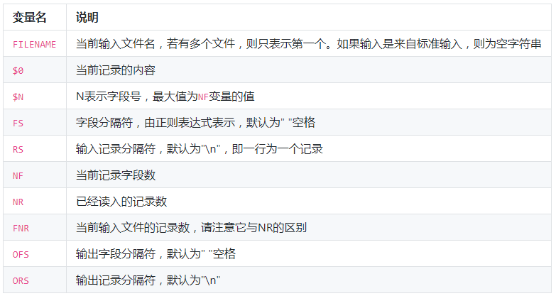

## 学习内容(目录)
```
    │       │
    ├──正则表达式基础
    │       │
    │       ├──文本处理命令
    │       │     │
    │       │     ├──tr 命令
    │       │     │
    │       │     ├──col 命令
    │       │     │
    │       │     ├──join 命令
    │       │     │
    │       │     └──paste命令
    │       │
    ├──数据流重定向
    │       │
    │       ├──数据流重定向
    │       │
    │       ├──标准错误重定向
    │       │
    │       ├──tee 命令
    │       │
    │       ├──永久重定向
    │       │
    │       ├──创建输出文件描述符
    │       │
    │       ├──关闭文件描述符
    │       │
    │       ├──屏蔽命令的输出
    │       │
    ├──挑战：历史命令
    └─ 
```

## 正则表达式

### 基础语法



### 运算优先级


### 思维导图


## grep 模式匹配

### 基本操作



### 使用正则表达式
```shell
# 将匹配以'z'开头以'o'结尾的所有字符串
$ echo 'zero\nzo\nzoo' | grep 'z.*o'
# 将匹配以'z'开头以'o'结尾，中间包含一个任意字符的字符串
$ echo 'zero\nzo\nzoo' | grep 'z.o'
# 将匹配以'z'开头,以任意多个'o'结尾的字符串
$ echo 'zero\nzo\nzoo' | grep 'zo*'
```
```shell
# grep默认是区分大小写的，这里将匹配所有的小写字母
$ echo '1234\nabcd' | grep '[a-z]'
# 将匹配所有的数字
$ echo '1234\nabcd' | grep '[0-9]'
# 将匹配所有的数字
$ echo '1234\nabcd' | grep '[[:digit:]]'
# 将匹配所有的小写字母
$ echo '1234\nabcd' | grep '[[:lower:]]'
# 将匹配所有的大写字母
$ echo '1234\nabcd' | grep '[[:upper:]]'
# 将匹配所有的字母和数字，包括0-9,a-z,A-Z
$ echo '1234\nabcd' | grep '[[:alnum:]]'
# 将匹配所有的字母
$ echo '1234\nabcd' | grep '[[:alpha:]]'
```

### 选择匹配


## sed 流编辑器

### 常用参数


### 执行命令


## awk 命令
