## 学习内容(目录)
```
    │       │
    ├──挑战：数据提取
    │       │
    ├──Linux 下软件安装
    │       │
    │       ├──apt 包管理工具
    │       │     │
    │       │     ├──软件安装
    │       │     │
    │       │     ├──软件卸载
    │       │     │
    │       │     ├──软件升级
    │       │     │
    │       │     └──软件卸载
    │       │
    │       ├──dpkg 包管理器
    │       │     │
    │       │     ├──dpkg 介绍
    │       │     │
    │       │     ├──软件安装
    │       │     │
    │       │     └──查看安装目录
    └─      └─
```
## 挑战：数据提取
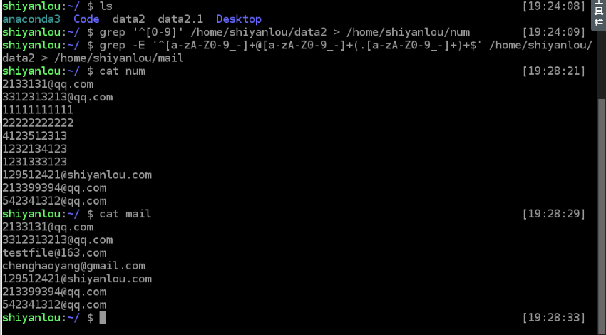

## apt 安装包

### 软件安装
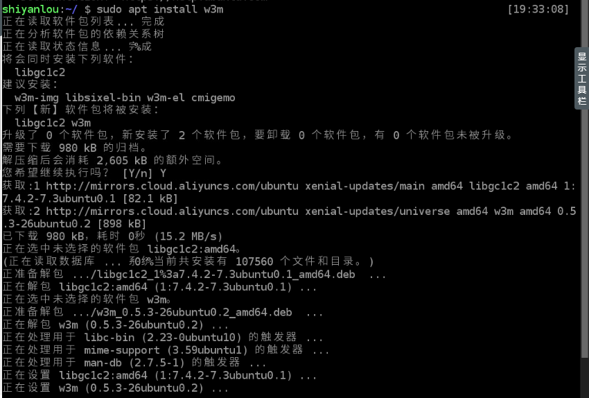
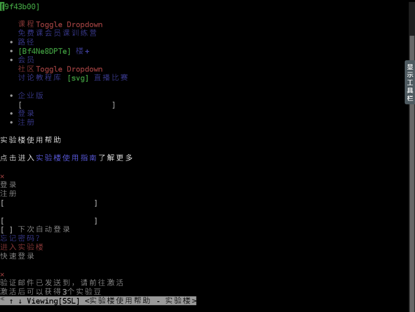

### 更新软件源
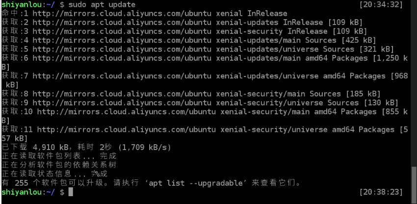

### apt 使用
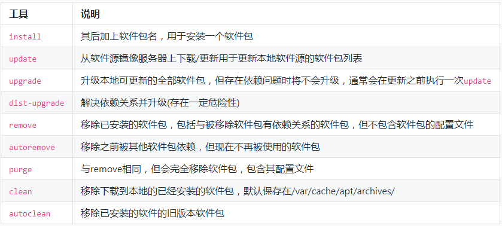
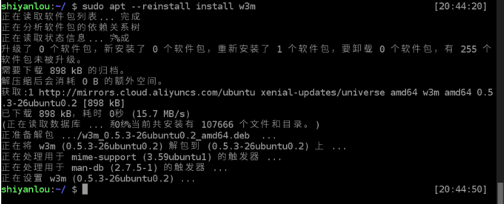

### 软件卸载
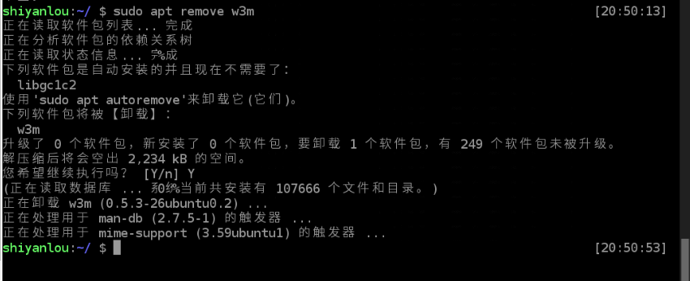
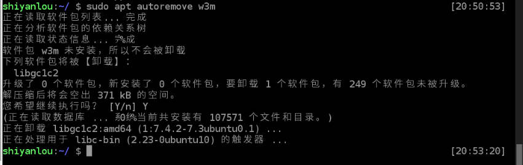
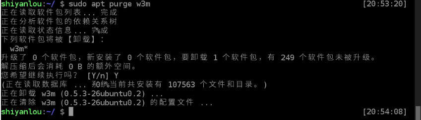

### 软件搜索
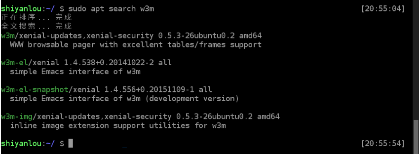

## dpkg 包管理器

### dpkg 
> dpkg 是 Debian 软件包管理器的基础，它被伊恩・默多克创建于 1993 年。dpkg 与 RPM 十分相似，同样被用于安装、卸载和供给和 .deb 软件包相关的信息。

> dpkg 本身是一个底层的工具。上层的工具，像是 APT，被用于从远程获取软件包以及处理复杂的软件包关系。"dpkg"是"Debian Package"的简写。

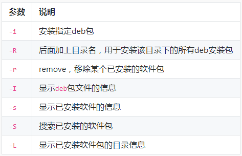

### dpkg 安装软件
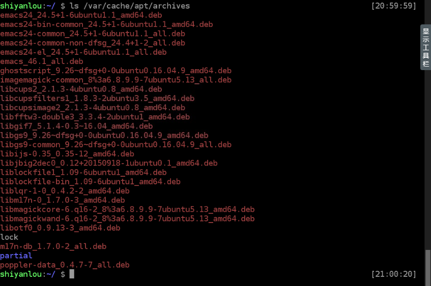
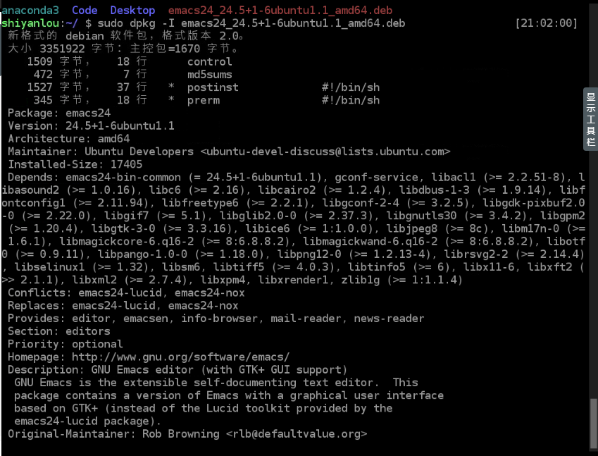

### 查看软件安装目录
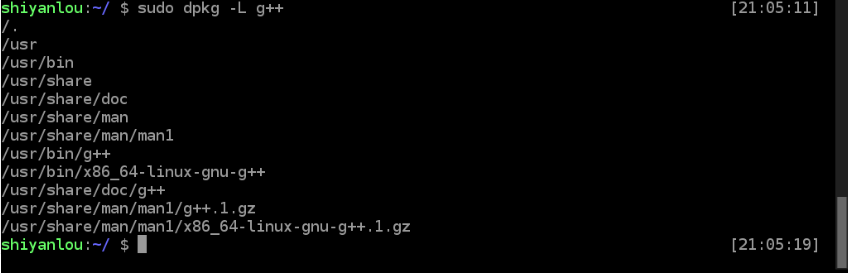

