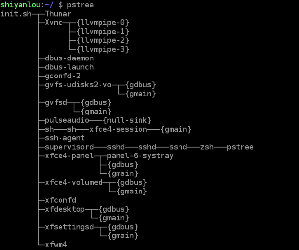
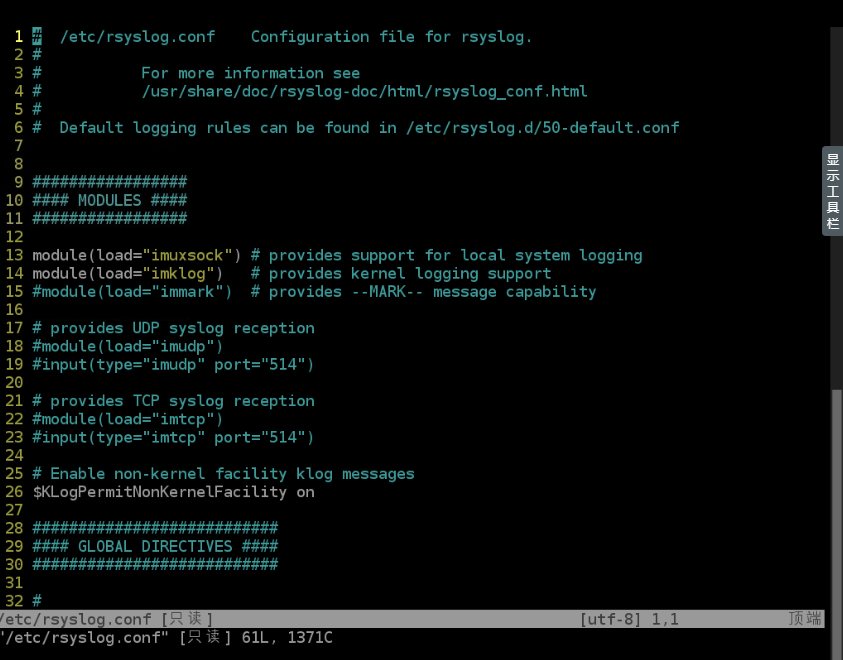

## 学习内容(目录)
```
    │       │
    ├──Linux 进程概念
    │       │
    │       ├──概念的理解
    │       │
    │       ├──进程的属性
    │       │     │
    │       │     ├──进程的分类
    │       │     │
    │       │     ├──进程的衍生
    │       │     │
    │       │     ├──进程组与Sessions
    │       │     │
    │       │     └──工作管理
    │       │
    ├──Linux 进程管理
    │       │
    │       ├──进程的查看
    │       │     │
    │       │     ├──top 工具的使用
    │       │     │
    │       │     ├──ps 工具的使用
    │       │     │
    │       │     └──pstree 工具的使用
    │       │
    │       ├──进程的管理
    │       │     │
    │       │     ├──kill 命令
    │       │     │
    │       │     └──进程的执行顺序
    │       │
    ├──Linux 日志系统
    │       │
    │       ├──常见的日志
    │       │
    │       ├──配置的日志
    │       │
    │       └──转储的日志
    └─ 
```
## linux 进程概念

### 程序与进程
> 程序（procedure）：不太精确地说，程序就是执行一系列有逻辑、有顺序结构的指令，帮我们达成某个结果。就如我们去餐馆，给服务员说我要牛肉盖浇饭，她执行了做牛肉盖浇饭这么一个程序，最后我们得到了这么一盘牛肉盖浇饭。它需要去执行，不然它就像一本武功秘籍，放在那里等人翻看。

> 进程（process）：进程是程序在一个数据集合上的一次执行过程，在早期的UNIX、Linux 2.4及更早的版本中，它是系统进行资源分配和调度的独立基本单位。同上一个例子，就如我们去了餐馆，给服务员说我要牛肉盖浇饭，她执行了做牛肉盖浇饭这么一个程序，而里面做饭的是一个进程，做牛肉汤汁的是一个进程，把牛肉汤汁与饭混合在一起的是一个进程，把饭端上桌的是一个进程。它就像是我们在看武功秘籍这么一个过程，然后一个篇章一个篇章地去练。

### 并发与并行
> 并发：在一个时间段内，宏观来看有多个程序都在活动，有条不紊的执行（每一瞬间只有一个在执行，只是在一段时间有多个程序都执行过）

> 并行：在每一个瞬间，都有多个程序都在同时执行，这个必须有多个 CPU 才行

### 线程
> 线程（thread）是操作系统能够进行运算调度的最小单位。它被包含在进程之中，是进程中的实际运作单位。一条线程指的是进程中一个单一顺序的控制流，一个进程中可以并发多个线程，每条线程并行执行不同的任务。因为线程中几乎不包含系统资源，所以执行更快、更有效率。

### fork 与 exec 系统调用
> fork() 是一个系统调用（system call），它的主要作用就是为当前的进程创建一个新的进程，这个新的进程就是它的子进程，这个子进程除了父进程的返回值和 PID 以外其他的都一模一样，如进程的执行代码段，内存信息，文件描述，寄存器状态等等

> exec() 也是系统调用，作用是切换子进程中的执行程序也就是替换其从父进程复制过来的代码段与数据段

### 进程与进程树



### 工作管理


### kill 命令


## linux 进程管理

### top 工具


### ps 工具


### pstree 工具


## 日志系统

### 常见的日志


### 配置的日志





### 转储的日志


