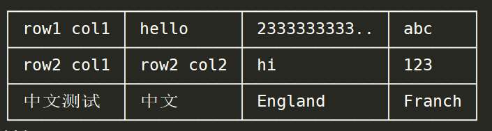

## mytable

### 功能
打印漂亮的表格

### 注意事项
打印的结果只能在等宽字体下才能正常显示

### 结果示例

```
┌───────────┬───────────┬──────────────┬────────┐
│ row1 col1 │ hello     │ 2333333333.. │ abc    │
├───────────┼───────────┼──────────────┼────────┤
│ row2 col1 │ row2 col2 │ hi           │ 123    │
├───────────┼───────────┼──────────────┼────────┤
│ 中文测试  │ 中文      │ England      │ Franch │
└───────────┴───────────┴──────────────┴────────┘
```

似乎github中(typora中各种主题也都无法显示为等宽)markdown中代码块的渲染不是使用等宽字符,所以行之间会有间隙
推荐使用全英文的数据,能够保证在所有情况下都是对齐的
